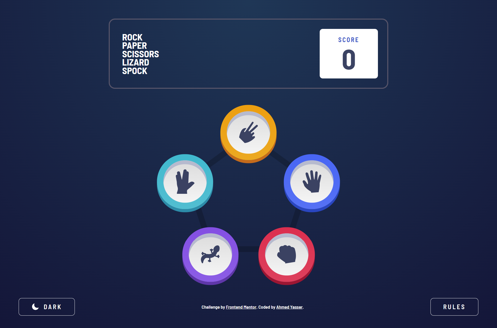
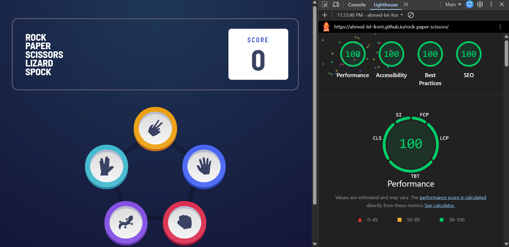
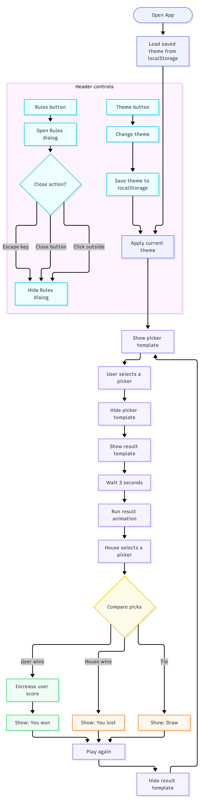

# Rock Paper Scissors Game

## Overview & Project Scope

Welcome to the **Rock Paper Scissors** game, a modern, highly interactive, and responsive web application implementing the classic hand game with expanded choices (Lizard, Spock). It features smooth UI transitions, dynamic theme switching with persistent storage, and optimized performance standards.

## Hero Preview



## Links

- **Live Demo URL:** [https://Ahmed-let-front.github.io/rock-paper-scissors/](https://Ahmed-let-front.github.io/rock-paper-scissors/)
- **Frontend Mentor Solution:** [https://www.frontendmentor.io/challenges/rock-paper-scissors-game-pTgwgvgH](https://www.frontendmentor.io/challenges/rock-paper-scissors-game-pTgwgvgH)

## Lighthouse Performance Audit



## AI Collaboration

- 🤖 **UI & Layout Assistance:** AI collaboration was utilized exclusively to assist with structuring and refining the user interface (UI) and layout architecture. All core application logic, DOM manipulation, and programming were independently engineered and implemented by the author.

---

## Logic Flowchart



---

## Core Features & Logic Pipelines

- 🎮 **Expanded Gameplay:** Classic Rock, Paper, Scissors enhanced with Lizard and Spock variants, complete with dynamic rules and score tracking.
- 🎨 **Interactive Theme Switcher:** Seamless switching between light and dark modes with persistent user preference stored via `localStorage`.
- ⚡ **Instant Theme Initialization:** Inline blocking script execution to apply saved themes instantly before the first paint, entirely preventing theme flashing.
- 🔄 **Dynamic UI Updates:** Smooth DOM manipulation and state management for game rounds, modals, and scoreboard updates.

## Tech Stack & Implementation Details

- 🧱 **Semantic HTML5 Markup:** Clean, accessible, and structured DOM hierarchy leveraging custom attributes (`data-*`).
- 💻 **Vanilla JavaScript:** Clean, structured procedural JavaScript utilizing robust event delegation and state handling.
- 🎨 **Tailwind CSS v4:** Utility-first styling utilizing advanced features, CSS variables, and `@media (prefers-color-scheme)` synchronization.
- ⚡ **Vite:** Next-generation frontend tooling ensuring ultra-fast HMR and optimized production builds.

## What I Learned & Architectural Highlights

- Mastering the native **Popover API** and HTML attributes (`popovertarget` and `popover`) to handle dialogs, modals, and popups cleanly in HTML.
- Implementing native **popover actions** (`show`, `hide`, `toggle`) directly via attributes to handle element states efficiently.
- Eliminating massive amounts of boilerplate JavaScript for managing visibility states, making the codebase significantly leaner.
- Achieving a highly maintainable and modular architecture by offloading UI state toggling to native HTML features.

---

## Project Initialization & Local Setup

To run this project locally, follow these steps:

### 1. Clone the repository:

```bash
git clone https://github.com/Ahmed-let-front/rock-paper-scissors.git
```

### 2. Navigate to the project directory:

```bash
cd rest-countries
```

### 3. Install dependencies:

```bash
npm install
```

### 4. Start the development server:

```bash
npm run dev
```

### 5. Build for production:

```bash
npm run build
```

---

## Vite Build Configuration

The project uses an optimized **vite.config.js** file tailored for production asset bundling and vendor chunk splitting:

```javascript
import { defineConfig } from 'vite';
import tailwindcss from '@tailwindcss/vite';

export default defineConfig({
  plugins: [tailwindcss()],
  base: '/rock-paper-scissors/',
  build: {
    sourcemap: false,
    rollupOptions: {
      output: {
        assetFileNames: 'assets/[name]-[hash][extname]',
        chunkFileNames: 'assets/[name]-[hash].js',
        entryFileNames: 'assets/[name]-[hash].js',
        manualChunks(id) {
          if (id.includes('node_modules')) {
            return 'vendor';
          }
        },
      },
    },
  },
});
```

---

## Author

- GitHub: [ahmed-let-front](https://github.com/Ahmed-let-front)
- Frontend Mentor: [Ahmed yasser](https://www.frontendmentor.io/profile/Ahmed-let-front)
- LinkedIn: [Ahmed Yasser](https://www.linkedin.com/in/ahmed-yasser-frontend/)

---

**Thanks** Created By **Ahmed Yasser** ❤️
